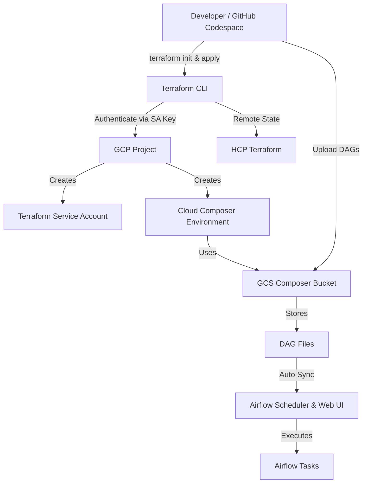

&nbsp;&nbsp;&nbsp;&nbsp;&nbsp;[](https://img.shields.io/github/issues/subhamay-bhattacharyya/cloud-composer-etl-pipeline)&nbsp;&nbsp;&nbsp;&nbsp;

## Google Cloud Composer Lab

This repository demonstrates how to provision and use **Google Cloud Composer (managed Apache Airflow)** using **Terraform**, configure IAM correctly, and work with the default **DAGs folder in Google Cloud Storage**.

---

## Project Description

### Overview

This project is a **hands-on infrastructure lab** that demonstrates how to provision and operate **Google Cloud Composer (Apache Airflow)** using **Terraform** with production-aligned best practices.

The lab focuses on **Infrastructure as Code (IaC)**, **secure authentication**, **proper IAM design**, and **operational workflows** for managing Airflow DAGs via Google Cloud Storage rather than manual UI interactions.

### What This Project Covers

- Provisioning **Cloud Composer 3 (Airflow 2.x)** using Terraform
- Using a **user-managed service account** instead of the default Compute Engine service account
- Correct **IAM role assignments** for Composer, Storage, and Service Usage
- Secure authentication using:
  - Google Cloud service account keys
  - GitHub Codespaces secrets
  - HCP Terraform remote backend
- Working with the **Composer DAGs GCS bucket**
- Uploading and validating Airflow DAGs
- Common Cloud Composer errors and how to troubleshoot them

### Target Audience

This lab is suitable for:

- Cloud Engineers and Data Engineers
- DevOps engineers using Terraform on GCP
- Engineers preparing for:
  - Google Cloud ACE / PDE certifications
  - Apache Airflow
  - Infrastructure-as-Code interviews
- Anyone looking for a **realistic Cloud Composer setup** beyond console-only demos

---

## Architecture Flow

### High-Level Flow Diagram



This repository demonstrates how to provision and use **Google Cloud Composer (managed Apache Airflow)** using **Terraform**, configure IAM correctly, and work with the default **DAGs folder in Google Cloud Storage**.

---

## Prerequisites

### GCP Project Setup

Create a Google Cloud project to be used for this Cloud Composer lab.

Example project ID:

- `gcc-etl-pipelines-06611`  
  *(The numeric suffix helps ensure global uniqueness.)*

Set the active project:

```bash
gcloud config set project <PROJECT_ID>
````

**Example:**

```bash
gcloud config set project gcc-etl-pipelines-06611
```

**Expected Output:**

```text
Updated property [core/project].
```

---

### Authenticate with Google Cloud

Authorize the Google Cloud CLI to access your account.

```bash
gcloud auth login --no-launch-browser
```

ℹ️ Note:
Use the --no-launch-browser flag if you are working in a remote environment (e.g., VS Code, Cloud Shell, SSH session).
The command will provide a URL that you can open in a local browser to complete authentication.

**Example Output:**

```text
Credentialed Accounts
ACTIVE  ACCOUNT
*       user@example.com
```

**Common Mistake**

❌ Incorrect flag – this will fail.
```bash
gcloud auth login --no-launch-bro
```
✔️ Correct flag is:
```text
--no-launch-browser
```

---

### (Optional) Verify Authentication

```bash
gcloud auth list
```

<!-- ### Required APIs

Enable the required Google Cloud APIs:

```bash
gcloud services enable \
  composer.googleapis.com \
  storage.googleapis.com \
  bigquery.googleapis.com \
  iam.googleapis.com
```

**Example:**

```bash
gcloud services enable \
  composer.googleapis.com \
  storage.googleapis.com \
  bigquery.googleapis.com \
  iam.googleapis.com \
  --project=gcc-etl-pipelines-06611
```

**Expected Output:**

```text
Operation "operations/xxxx" finished successfully.
``` -->

---

## Service Account Setup

Cloud Composer should use a **user-managed service account** instead of the default Compute Engine service account.

### Create Service Account

```bash
gcloud iam service-accounts create terraform-sa \
  --display-name="Terraform Service Account"
```

**Expected Output:**

```text
Created service account [terraform-sa].
```

Verify creation:

```bash
gcloud iam service-accounts list
```

---

### Assign Required IAM Roles

>  ⚠️ Important Security Notice
The roles listed below follow the principle of least privilege and should be preferred.

> 
```markdown
In some lab or troubleshooting scenarios, you may be tempted to grant the roles/editor role to the Terraform service account to bypass IAM errors. This role is highly permissive and must be avoided in production environments.

If roles/editor is used temporarily, remove it immediately after the infrastructure is created and replace it with the minimal required roles listed below.
```

#### Cloud Composer & Terraform Service Account Roles (Required)

##### Required to create and manage service accounts
```bash
gcloud projects add-iam-policy-binding YOUR_PROJECT_ID \
  --member="serviceAccount:terraform-sa@YOUR_PROJECT_ID.iam.gserviceaccount.com" \
  --role="roles/iam.serviceAccountAdmin"
```

##### Required to enable and manage GCP APIs
```bash
gcloud projects add-iam-policy-binding "${PROJECT_ID}" \
  --member="serviceAccount:terraform-sa@YOUR_PROJECT_ID.iam.gserviceaccount.com" \
  --role="roles/composer.admin"
```

##### Grant ActAs only on the Composer runtime SA (recommended)
```bash
gcloud projects add-iam-policy-binding YOUR_PROJECT_ID \
  --member="serviceAccount:composer-sa@YOUR_PROJECT_ID.iam.gserviceaccount.com" \
  --role="roles/iam.serviceAccountUser"
```


> #### ⚠️ Temporary Workaround (Strongly Discouraged)

🚨 Use only for local labs or short-lived testing

The roles/editor role grants broad permissions across the project and violates least-privilege best practices.
Do NOT use this in production.

```bash
gcloud projects add-iam-policy-binding YOUR_PROJECT_ID \
  --member="serviceAccount:terraform-sa@YOUR_PROJECT_ID.iam.gserviceaccount.com" \
  --role="roles/editor"
```

**Example:**

```bash
export PROJECT_ID="gcc-etl-pipelines-06611"
export TF_SA="terraform-sa@${PROJECT_ID}.iam.gserviceaccount.com"
export COMPOSER_SA="composer-sa@${PROJECT_ID}.iam.gserviceaccount.com"


# Enable APIs
gcloud projects add-iam-policy-binding "${PROJECT_ID}" \
  --member="serviceAccount:${TF_SA}" \
  --role="roles/serviceusage.serviceUsageAdmin"

# Create/manage Composer environments
gcloud projects add-iam-policy-binding "${PROJECT_ID}" \
  --member="serviceAccount:${TF_SA}" \
  --role="roles/composer.admin"

# Grant ActAs only on the Composer runtime SA (recommended)
gcloud iam service-accounts add-iam-policy-binding "${COMPOSER_SA}" \
  --member="serviceAccount:${TF_SA}" \
  --role="roles/iam.serviceAccountUser"
```
---

#### Optional: Editor Role (For Labs / Learning Only)

> #### ⚠️ **Not recommended for production**

```bash
gcloud projects add-iam-policy-binding YOUR_PROJECT_ID \
  --member="serviceAccount:terraform-sa@YOUR_PROJECT_ID.iam.gserviceaccount.com" \
  --role="roles/editor"
```

**Example:**

```bash
gcloud projects add-iam-policy-binding gcc-etl-pipelines-06611 \
  --member="serviceAccount:terraform-sa@gcc-etl-pipelines-06611.iam.gserviceaccount.com" \
  --role="roles/editor"
```

> #### 📌 Mandatory Cleanup Step

#### After Terraform successfully completes:

```bash
gcloud projects remove-iam-policy-binding YOUR_PROJECT_ID \
  --member="serviceAccount:terraform-sa@YOUR_PROJECT_ID.iam.gserviceaccount.com" \
  --role="roles/editor"
```
---

#### Verify Assigned Roles

```bash
gcloud projects get-iam-policy YOUR_PROJECT_ID \
  --flatten="bindings[].members" \
  --filter="bindings.members:terraform-sa@" \
  --format="table(bindings.role)"
```

**Example:**

```bash
gcloud projects get-iam-policy gcc-etl-pipelines-06611 \
  --flatten="bindings[].members" \
  --filter="bindings.members:terraform-sa@" \
  --format="table(bindings.role)"
```

**Expected Output:**

```text
ROLE
roles/composer.worker
roles/editor
```

#### Create and Download the Service Account JSON Key
```bash
gcloud iam service-accounts keys create terraform-sa-key.json \
  --iam-account="terraform-sa@YOUR_PROJECT_ID.iam.gserviceaccount.com"
```

**Example:**
```bash
gcloud iam service-accounts keys create terraform-sa-key.json \
  --iam-account="terraform-sa@gcc-etl-pipelines-06611.iam.gserviceaccount.com"
```

#### Configure Terraform to Use the Service Account

Save the json file `terraform-sa-key.json` to `/tf/tf-sa-key`

```bash
export GOOGLE_APPLICATION_CREDENTIALS="/absolute/path/to/terraform-sa-key.json"
```
**Example:**

```bash
export GOOGLE_APPLICATION_CREDENTIALS="/tf/tf-sa-key/terraform-sa-key.json"
```


> #### ⚠️ Add the file terraform-sa-key.json to .gitignore

Add the file terraform-sa-key.json to .gitignore so that the file is not saved to the repository

## Create Codespaces Secret for Terraform Service Account

Create a **GitHub Codespaces secret** to securely store the Google Cloud service account key used by Terraform.

### Steps

1. Generate a **JSON key** for the Google Cloud service account that Terraform will use.
2. In your GitHub repository, navigate to:

   **Settings → Secrets and variables → Codespaces**
3. Create a new secret with the following details:

   - **Name:** `TERRAFORM_SA_KEY`
   - **Value:** Paste the full contents of the service account JSON key

4. Save the secret.

### How This Is Used in Codespaces

At the time of **GitHub Codespace launch**, the value of the `TERRAFORM_SA_KEY` secret is automatically injected into the Codespace as an environment variable.  
A startup or post-create script converts this secret into a **JSON key file** on the filesystem, which Terraform then uses for authentication with Google Cloud.

> 🔐 **Security Note:**  
> - The JSON key file is created **only inside the ephemeral Codespace environment**
> - The key is **never committed** to source control
> - Always delete unused service account keys and rotate them regularly

This approach enables secure, automated authentication for Terraform while keeping credentials out of the repository.


---

## Set Up Workspace in HCP Terraform

Create a workspace within a project in **HCP Terraform** to manage the infrastructure state for this repository.

1. In HCP Terraform, create a new **project** (or use an existing one).
2. Under the project, create a **workspace** for this repository.
3. Generate an **API token** in HCP Terraform with access to the workspace.
4. Store the API token securely as a **Codespaces secret** named:

   `TF_TOKEN_APP_TERRAFORM_IO`

This token allows Terraform to authenticate with HCP Terraform for remote state management and operations.


---
## Terraform Setup

### Required Tools

Ensure the following tools are installed:

* Terraform ≥ 1.5
* Google Cloud CLI

Verify:

```bash
terraform version
gcloud version
```

---

## Terraform Login (HCP Terraform Backend)

To use **HCP Terraform** (Terraform Cloud) as the remote backend for state storage and runs, you must authenticate Terraform with your HCP Terraform account.

### Prerequisite

Make sure you have created and saved a Codespaces secret named:

- `TF_TOKEN_APP_TERRAFORM_IO`

(See: **Setup workspace in HCP Terraform**)

### Authenticate Terraform

Run:

```bash
terraform login
```

This command opens a browser flow (or prints a URL in headless environments) and stores a token locally in:

-  ~/.terraform.d/credentials.tfrc.json

**Example (Headless / Codespaces)**

If you are running inside GitHub Codespaces and cannot launch a browser automatically:

```bash
terraform login
```

**Example Output:**

```text
Terraform will request an API token for app.terraform.io using your browser.
If you can't use a browser, follow this link to generate a token:
https://app.terraform.io/app/settings/tokens?source=terraform-login
```

**Verify Login
**
You can confirm Terraform has credentials stored by checking:

```bash
cat ~/.terraform.d/credentials.tfrc.json
```


✅ You should see an entry for app.terraform.io.

**Notes**

- If TF_TOKEN_APP_TERRAFORM_IO is set in the environment (for example, via Codespaces secrets),
- Terraform will automatically use it for app.terraform.io authentication.

Do not commit credentials.tfrc.json to source control.
---

#### Create Cloud Composer Environment

This project uses **Terraform** to provision a **Cloud Composer 3 (Apache Airflow 2.x)** environment.

#### Initialize Terraform

```bash
terraform init
```

**Expected Output:**

```text
Terraform has been successfully initialized!
```

---

#### Apply Terraform Configuration

```bash
terraform apply
```

Confirm when prompted.

> ⏳ **Note:** Environment creation can take **20–30 minutes**.

---

#### Retrieve the DAGs Folder (GCS)

Once the environment is created, Terraform outputs the DAGs GCS prefix:

```bash
terraform output dag_gcs_prefix
```

**Example Output:**

```text
gs://us-central1-composer-xxxx-bucket/dags
```

List the DAGs directory:

```bash
gcloud storage ls gs://us-central1-composer-xxxx-bucket/dags/
```

---

#### Upload a DAG

Upload a DAG file to the Composer environment:

```bash
gcloud composer environments storage dags import \
  --environment YOUR_ENV_NAME \
  --location us-central1 \
  --source ./dags/sample_dag.py
```

**Example:**

```bash
gcloud composer environments storage dags import \
  --environment composer-env \
  --location us-central1 \
  --source ./dags/hello_composer.py
```

**Expected Output:**

```text
Importing DAGs...
Operation completed successfully.
```

The DAG will appear in the **Airflow Web UI** within a few minutes.

---

#### Access Airflow Web UI

Navigate to:

```text
Google Cloud Console → Cloud Composer → Environment → Airflow Web UI
```

Log in using your Google Cloud account.

---

## Troubleshooting

#### Error: `roles/composer.worker` Missing

```text
composer-sa@... is expected to have at least one role like roles/composer.worker
```

**Fix:** Assign `roles/composer.worker` to the environment service account.

---

#### Error: GCS Bucket Name Restricted

```text
Use of this bucket name is restricted: 'us-central1-google-composer-xxxx-bucket'
```

**Fix:** Use a **custom bucket name** that does not contain `google` or `goog`.

---

#### Error: Storage Permissions Missing

```text
storage.objects.list permission denied
```

**Fix:** Grant `roles/storage.objectAdmin` or temporarily `roles/editor`.

---

#### Cleanup

To avoid unnecessary charges, destroy all resources:

```bash
terraform destroy
```

---

#### References

* [https://cloud.google.com/composer](https://cloud.google.com/composer)
* [https://cloud.google.com/composer/docs](https://cloud.google.com/composer/docs)
* [https://airflow.apache.org/docs](https://airflow.apache.org/docs)


