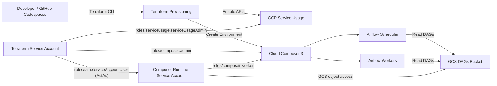

&nbsp;&nbsp;&nbsp;&nbsp;&nbsp;[](https://img.shields.io/github/issues/subhamay-bhattacharyya/cloud-composer-etl-pipeline)&nbsp;&nbsp;&nbsp;&nbsp;

---

# Google Cloud Composer Lab

This repository demonstrates how to provision and operate **Google Cloud Composer (managed Apache Airflow)** using **Terraform**, configure **IAM correctly**, and manage **Airflow DAGs via Google Cloud Storage (GCS)**.

---

## Project Description

### Overview

This project is a **hands-on infrastructure lab** that demonstrates how to provision and operate **Google Cloud Composer 3 (Apache Airflow 2.x)** using **Terraform**, following **production-aligned best practices**.

The lab focuses on:

* Infrastructure as Code (IaC)
* Secure authentication
* Least-privilege IAM design
* Operational workflows for managing Airflow DAGs using **GCS instead of UI-based uploads**

---

### What This Project Covers

* Provisioning **Cloud Composer 3 (Airflow 2.x)** using Terraform
* Using **user-managed service accounts** instead of default Compute Engine service accounts
* Correct **IAM role separation** for:

  * Terraform provisioning
  * Composer runtime
* Secure authentication using:

  * Google Cloud service account keys
  * GitHub Codespaces secrets
  * HCP Terraform remote backend
* Working with the **Composer DAGs GCS bucket**
* Uploading and validating Airflow DAGs
* Common Cloud Composer errors and troubleshooting guidance

---

### Target Audience

This lab is suitable for:

* Cloud Engineers and Data Engineers
* DevOps engineers using Terraform on GCP
* Engineers preparing for:

  * Google Cloud ACE / PDE certifications
  * Apache Airflow
  * Infrastructure-as-Code interviews
* Anyone looking for a **realistic Cloud Composer setup** beyond console-only demos

---

## Architecture Flow

### High-Level Architecture



---

## Prerequisites

### GCP Project Setup

Create a Google Cloud project for this lab.

Example project ID:

```text
gcc-etl-pipelines-06611
```

> The numeric suffix helps ensure global uniqueness.

Set the active project:

```bash
gcloud config set project <PROJECT_ID>
```

Example:

```bash
gcloud config set project gcc-etl-pipelines-06611
```

Expected output:

```text
Updated property [core/project].
```

---

### Authenticate with Google Cloud

Authorize the Google Cloud CLI:

```bash
gcloud auth login --no-launch-browser
```

ℹ️ **Note**
Use `--no-launch-browser` when working in remote environments (Codespaces, SSH, Cloud Shell).

**Common mistake (incorrect flag):**

```bash
gcloud auth login --no-launch-bro
```

✔️ Correct flag:

```text
--no-launch-browser
```

(Optional) Verify authentication:

```bash
gcloud auth list
```

---

## Service Account Setup

Cloud Composer should use **user-managed service accounts** rather than the default Compute Engine service account.

### Create Terraform Service Account

```bash
gcloud iam service-accounts create terraform-sa \
  --display-name="Terraform Service Account"
```

Verify:

```bash
gcloud iam service-accounts list
```

---

## Assign Required IAM Roles

⚠️ **Important Security Notice**

The roles below follow the **principle of least privilege** and should be preferred.

> You may be tempted to grant `roles/editor` to bypass IAM errors.
> **This role is highly permissive and must NOT be used in production.**
> If `roles/editor` is used temporarily for labs, **remove it immediately** after provisioning.

---

### Roles for Terraform Service Account (`terraform-sa`)

#### Enable and manage GCP APIs

```bash
gcloud projects add-iam-policy-binding YOUR_PROJECT_ID \
  --member="serviceAccount:terraform-sa@YOUR_PROJECT_ID.iam.gserviceaccount.com" \
  --role="roles/serviceusage.serviceUsageAdmin"
```

#### Create and manage Cloud Composer environments

```bash
gcloud projects add-iam-policy-binding YOUR_PROJECT_ID \
  --member="serviceAccount:terraform-sa@YOUR_PROJECT_ID.iam.gserviceaccount.com" \
  --role="roles/composer.admin"
```

---

### Grant ActAs on Composer Runtime Service Account (Required)

Terraform must be allowed to **act as** the Composer runtime service account.

> ⚠️ This role must be granted **on the service account**, not on the project.

```bash
gcloud iam service-accounts add-iam-policy-binding composer-sa@YOUR_PROJECT_ID.iam.gserviceaccount.com \
  --member="serviceAccount:terraform-sa@YOUR_PROJECT_ID.iam.gserviceaccount.com" \
  --role="roles/iam.serviceAccountUser"
```

---

### 🚨 Temporary Workaround (Strongly Discouraged)

```bash
gcloud projects add-iam-policy-binding YOUR_PROJECT_ID \
  --member="serviceAccount:terraform-sa@YOUR_PROJECT_ID.iam.gserviceaccount.com" \
  --role="roles/editor"
```

📌 **Mandatory Cleanup**

```bash
gcloud projects remove-iam-policy-binding YOUR_PROJECT_ID \
  --member="serviceAccount:terraform-sa@YOUR_PROJECT_ID.iam.gserviceaccount.com" \
  --role="roles/editor"
```

---

### Verify Assigned Roles

```bash
gcloud projects get-iam-policy YOUR_PROJECT_ID \
  --flatten="bindings[].members" \
  --filter="bindings.members:terraform-sa@" \
  --format="table(bindings.role)"
```

---

## Create and Download Service Account Key

```bash
gcloud iam service-accounts keys create terraform-sa-key.json \
  --iam-account="terraform-sa@YOUR_PROJECT_ID.iam.gserviceaccount.com"
```

⚠️ **Add this file to `.gitignore` immediately** (do not commit JSON keys).

---

## Configure Terraform Authentication

```bash
export GOOGLE_APPLICATION_CREDENTIALS="/absolute/path/to/terraform-sa-key.json"
```

---

## GitHub Codespaces Integration

### Create Codespaces Secret

* **Name:** `TERRAFORM_SA_KEY`
* **Value:** Full contents of the service account JSON key

### How This Is Used

* Injected into Codespaces as an environment variable
* Converted into a JSON key file during Codespace startup
* Never committed to source control

🔐 **Security Notes**

* Keys exist only inside ephemeral Codespaces
* Rotate and delete unused keys regularly

---

## HCP Terraform Setup

Create a workspace and store the API token as a Codespaces secret:

```text
TF_TOKEN_APP_TERRAFORM_IO
```

Terraform will automatically use this token if present.

---

## Terraform Setup

Verify tools:

```bash
terraform version
gcloud version
```

Authenticate Terraform:

```bash
terraform login
```

---

## Create Cloud Composer Environment

```bash
terraform init
terraform apply
```

⏳ **Note:** Provisioning takes ~20–30 minutes.

---

## DAGs Management

Retrieve DAGs bucket prefix:

```bash
terraform output dag_gcs_prefix
```

Upload a DAG:

```bash
gcloud composer environments storage dags import \
  --environment YOUR_ENV_NAME \
  --location us-central1 \
  --source ./dags/sample_dag.py
```

---

## Access Airflow Web UI

Navigate to:

```text
GCP Console → Cloud Composer → Environment → Airflow Web UI
```

---

## Troubleshooting

### Error: `iam.serviceAccounts.actAs`

**Fix:** Grant `roles/iam.serviceAccountUser` on the Composer runtime service account.

### Error: `roles/composer.worker` missing

**Fix:** Assign `roles/composer.worker` to the Composer runtime service account.

### Error: Storage permission denied

**Fix:** Grant `roles/storage.objectAdmin` to the **Composer runtime service account** (avoid `roles/storage.admin` unless you truly need bucket admin).

---

## Cleanup

To avoid unnecessary charges:

```bash
terraform destroy
```

---

## References

* [https://cloud.google.com/composer](https://cloud.google.com/composer)
* [https://cloud.google.com/composer/docs](https://cloud.google.com/composer/docs)
* [https://airflow.apache.org/docs](https://airflow.apache.org/docs)
